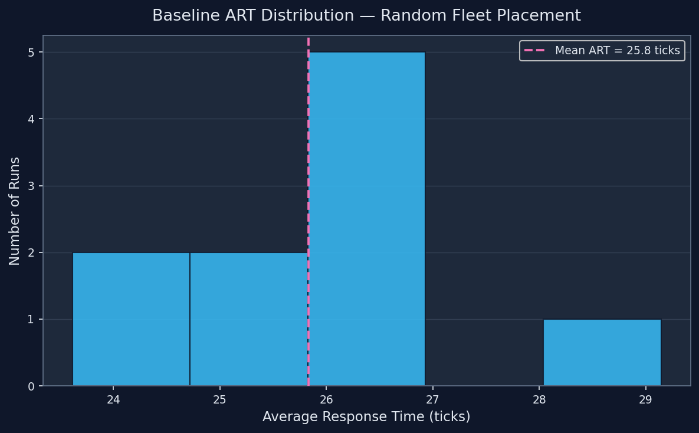
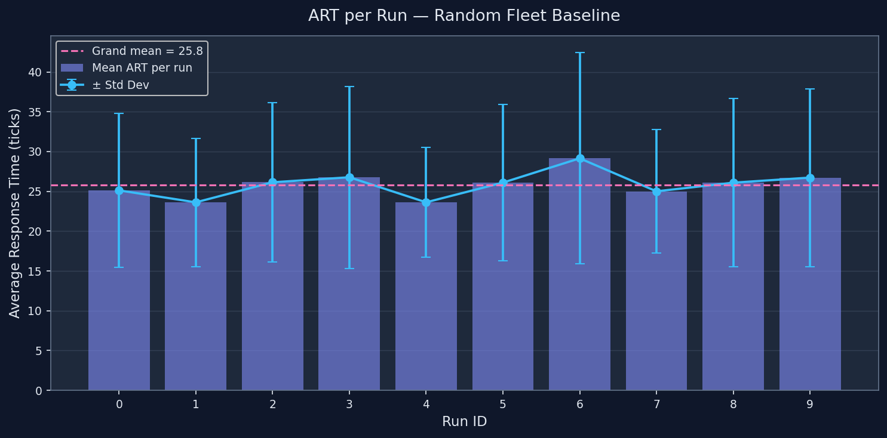

# Baseline Report — Random Fleet Placement (Sprint 8)

*Generated automatically by `src/analyze_baseline.py` on 2026-05-08 18:56 UTC*

---

## Summary Statistics

| Metric | Value |
|--------|-------|
| Runs completed | 10 |
| Total events processed | 460 |
| **Grand mean ART** | **25.83 ticks** |
| Grand std dev | 1.54 ticks |
| Min run ART | 23.61 ticks |
| Max run ART | 29.14 ticks |

---

## Per-Run Results

| Run | Seed | Events | Mean ART | Std ART | Ticks |
|-----|------|--------|----------|---------|-------|
| 0 | 42 | 49 | 25.12 | 9.69 | 1000 |
| 1 | 43 | 52 | 23.61 | 8.06 | 1000 |
| 2 | 44 | 44 | 26.14 | 10.03 | 1000 |
| 3 | 45 | 43 | 26.77 | 11.44 | 1000 |
| 4 | 46 | 42 | 23.62 | 6.91 | 1000 |
| 5 | 47 | 54 | 26.09 | 9.86 | 1000 |
| 6 | 48 | 42 | 29.14 | 13.28 | 1000 |
| 7 | 49 | 42 | 25.00 | 7.78 | 1000 |
| 8 | 50 | 34 | 26.09 | 10.58 | 1000 |
| 9 | 51 | 58 | 26.72 | 11.17 | 1000 |

---

## Visualizations

### ART Distribution

### ART per Run (Time-Series)

---

## Observations — Inefficiencies of Random Placement

1. **Spatial clustering**: Random sampling frequently places multiple stations
   in the same district, leaving other zones uncovered. This increases travel
   distance for events that spawn far from any cluster.

2. **Uncovered zones**: With only 5 stations on a large road network, random
   placement has no awareness of event demand density. High-demand areas
   identified by the HDBSCAN hotspot detector (Sprint 6) are often left without
   nearby coverage.

3. **High variance between runs**: The wide standard deviation in ART across
   runs (std = 1.54) reflects the randomness of the placement.
   Optimized placements should reduce both mean ART and variance.

4. **Long travel distances**: Without optimized positioning, ambulances
   regularly traverse longer paths, contributing to higher response times.
   The A* pathfinder correctly finds shortest routes, but start proximity
   is the dominant factor.

---

## Next Steps

- **Sprint 9**: Run the same scenario with the Genetic Algorithm–optimized
  fleet (`src/run_genetic_algorithm.py`) to obtain a comparable ART.
- Compare grand mean ART (random: **25.83**) against optimized ART
  to quantify the improvement.
- Use `outputs/random_fleet_log.json` to audit individual placement sets if
  any run shows an anomalous ART.
