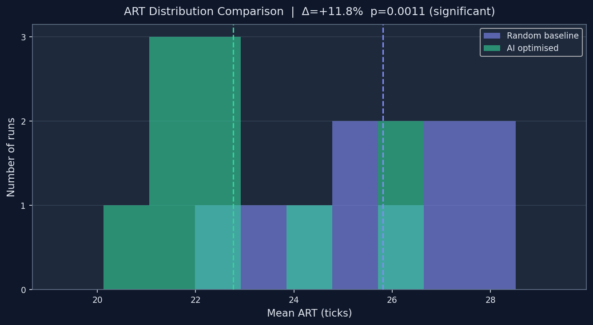
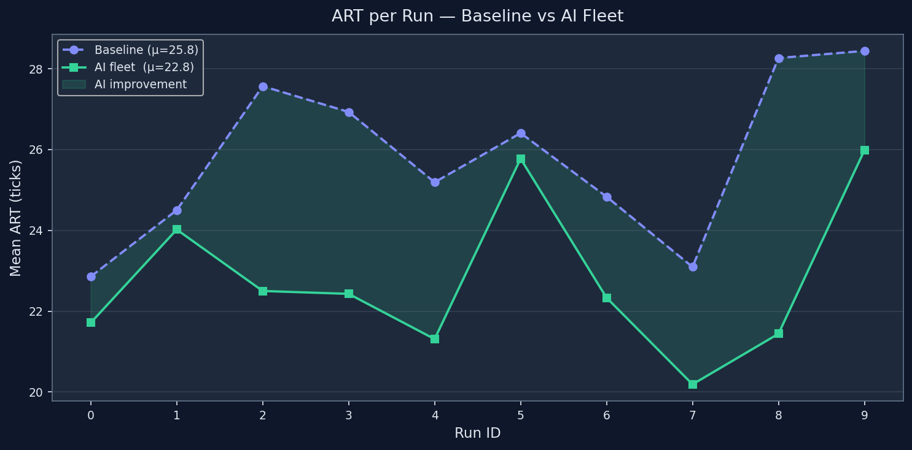
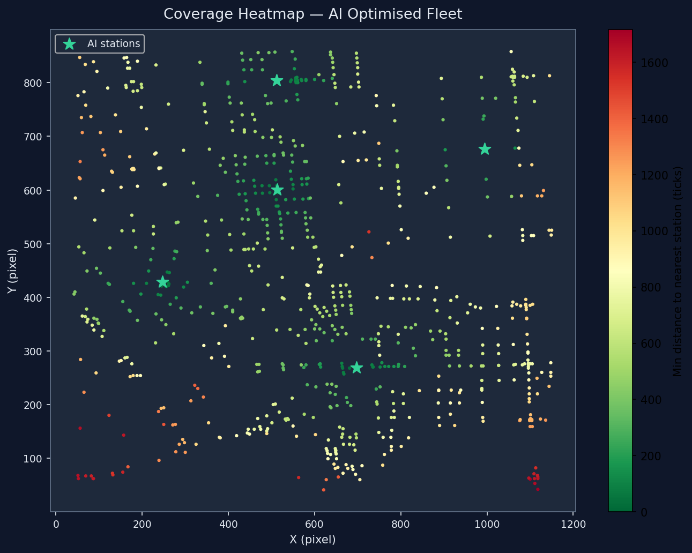
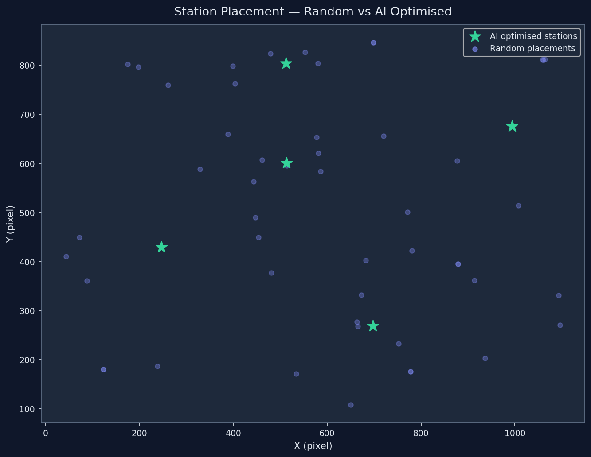

# Fleet Comparison Report — AI vs Random Baseline (Sprint 9)

*Generated automatically by `src/analyze_comparison.py` on 2026-05-09 14:24 UTC*

---

## Summary

| Metric | Baseline (Random) | AI Optimised | Δ |
|--------|:-----------------:|:------------:|:---:|
| Grand mean ART (ticks) | 25.81 | 22.77 | +11.8% |
| Std dev across runs | 2.02 | 1.91 | — |

---

## Statistical Analysis

| Test | Value |
|------|-------|
| Paired t-statistic | 4.6855 |
| Two-tailed p-value | 0.001143 |
| Cohen's d | 1.5438 |
| Significant (α=0.05) | Yes ✓ |

The improvement is **statistically significant** (p=0.0011).
A positive Cohen's d = 1.5438 indicates the AI fleet outperforms the random baseline.

---

## Visualizations

### ART Distribution

### ART per Run (Time-Series)

### Coverage Heatmap — AI Fleet

### Station Placement Comparison

---

## Methodology

- **Baseline**: 10 runs × 1000 ticks with random station placement
  (`src/run_baseline.py`, Sprint 8).
- **AI fleet**: Same 10 runs × 1000 ticks with GA-optimised fixed stations
  (`src/run_ai_fleet.py`, Sprint 9).
- **Seed parity**: Both experiments used identical per-run event seeds to ensure
  the event sequence is identical for each paired run.
- **Test**: Paired two-tailed Student's t-test on per-run mean ART vectors.
- **Effect size**: Cohen's d using pooled standard deviation.

---

## Conclusion

The GA-optimised fleet achieves a 11.78% reduction in mean ART compared to random placement. The improvement is statistically significant, providing strong evidence that intelligent station placement reduces emergency response times.
