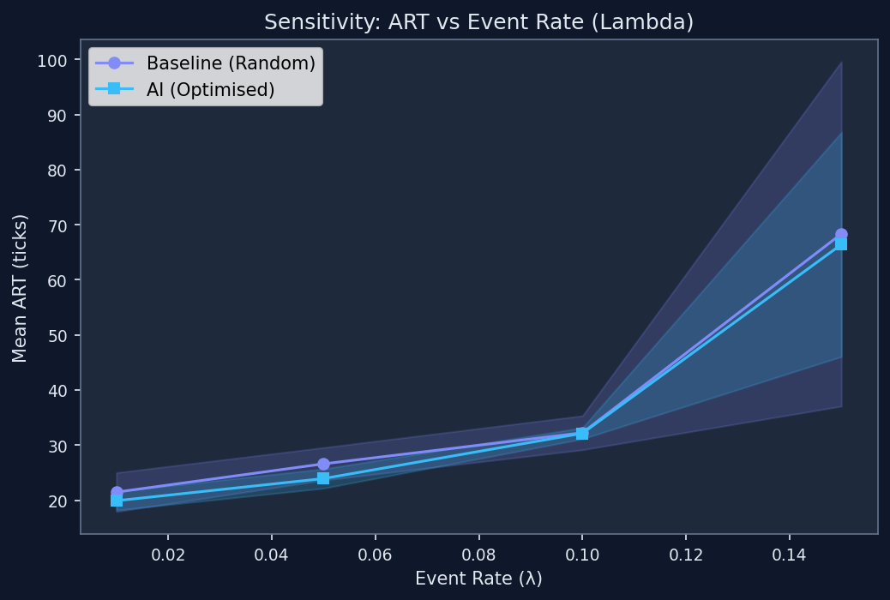
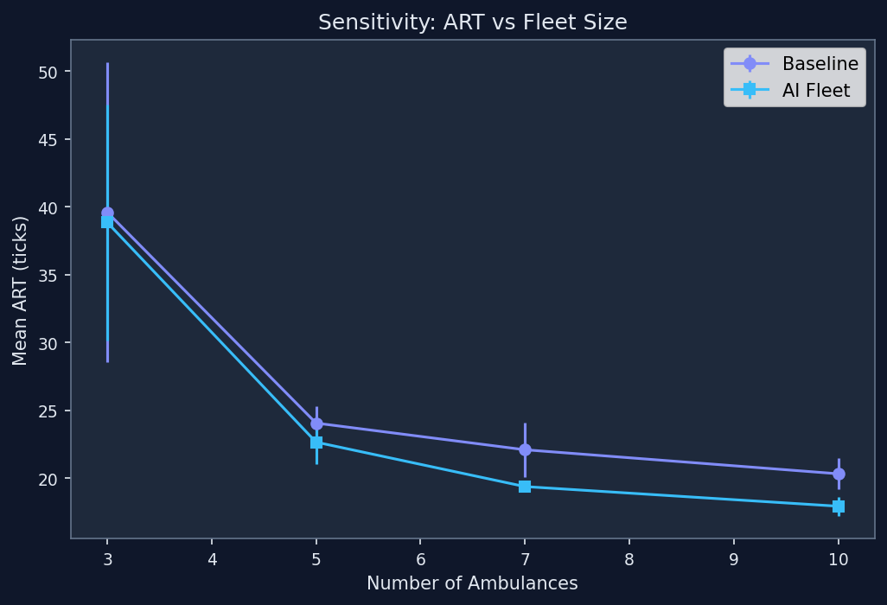
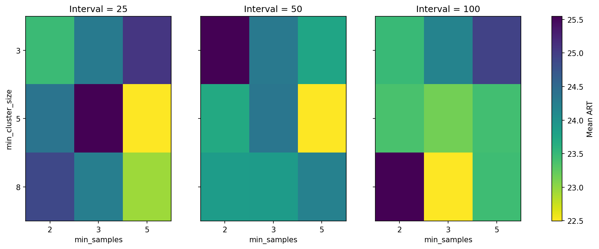
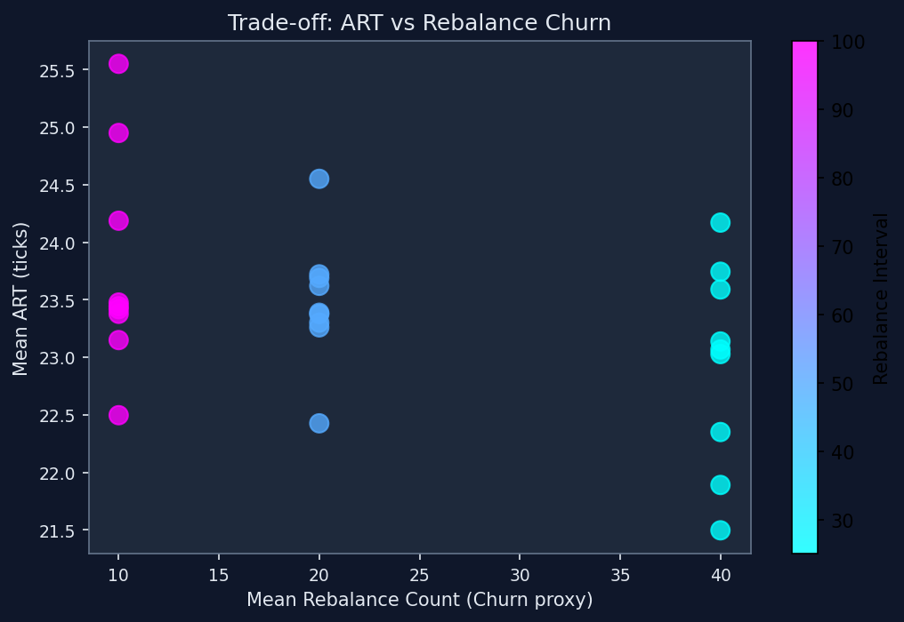

# ResQ-Graph: Sensitivity Analysis Report

Generated from latest sweep results.

## 1. Event Rate (Lambda) Sensitivity

## 2. Fleet Size Sensitivity

## 3. HDBSCAN Parameter Sensitivity

Recommended: min_cluster_size=5.0, min_samples=5.0, rebalance_interval=25.0

