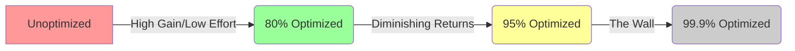

Putting effort into performance optimization is a strategic trade-off between **Efficiency** and **Engineering Velocity**. For high-performance systems like yours (utilizing Polars, NoGIL, and SIMD), the "Worth" of an optimization is rarely about the absolute speedup, but rather about the **Utility Shift**.

I have synthesized a framework to help you identify the precise point where you should stop optimizing and move on to the next high-impact task.

### 📐 The Performance Utility Framework

> [!IMPORTANT]
> **The Golden Rule**: Optimization is worth it if and only if the **Value of Time Saved** (Human + Machine) over the lifecycle of the feature exceeds the **Cost of Engineering** + the **Complexity Tax** (Maintenance).

#### 1. The "Human Perception" Thresholds (UX)

If you are optimizing user-facing components (e.g., your Retail Dashboards), gains are only "worth it" if they cross a qualitative boundary:

- **100ms → 20ms**: Not worth it. Both feel "instant."
- **1.2s → 0.8s**: **CRITICAL**. This crosses the 1-second threshold where users lose "flow."
- **10s → 5s**: **HIGH VALUE**. Keeps users from switching tabs.

#### 2. The 80/20 Rule (Pareto Principle)

Most performance gains follow a logarithmic curve.

- **Phase 1 (The Low Hanging Fruit)**: Fixing N+1 queries, adding indices, vectorizing loops. **(20% Effort = 80% Gain)**. Always worth it.
- **Phase 2 (The Structural Pivot)**: Switching from Pandas to Polars, implementing Multi-threading. **(50% Effort = 15% Gain)**. Worth it for core hot-paths.
- **Phase 3 (The Micro-Optimization)**: Cache-line alignment, manual SIMD, assembly-level tuning. **(90% Effort = 5% Gain)**. Only worth it if you are building a library or a high-frequency trading engine.

#### 3. Amdahl's Law (Mathematical Intuition)

The theoretical speedup is always limited by the **serial** portion of your code.

$$
Speedup = \frac{1}{(1 - P) + \frac{P}{S}}
$$

- $P$ = Parallelizable portion.
- $S$ = Speedup of that portion.

If 90% of your code is parallelized ($P=0.9$) and you make it **infinitely fast** ($S = \infty$), your total speedup is still only **10x**. If the serial part is the bottleneck, spending effort on the parallel part is a literal waste of time.

---

### 🧠 Performance/Effort Decision Matrix

I've created an analysis of the "Optimization Worth" specifically for your current development profile.

### 🛠 Actionable Recommendation for `Retail-IQ`

Given your current use of **Polars** and **NoGIL**:

1. **STOP** when the bottleneck shifts from **Computation** to **I/O** (Disk/Network). At that point, code optimizations yield nearly zero real-world gain.
2. **STOP** when the time spent optimizing exceeds the **Total Cumulative Execution Time** of the script over the next 6 months.
3. **PRIORITIZE** "Clean Performance" (Minimalism). As your `REFLECTIONS.md` states: **[CAVEMAN-OPT] Code is a Liability.** If an optimization adds 50 lines of complex logic for a 5% gain, it is a net-negative for the project's health.

**In summary**: If you can't feel the difference without a stopwatch, and the cloud bill isn't shrinking noticeably, you have hit the wall. Move to the next feature.

### 🧠 Reflection Harvest

- `MISTAKE/PREFERENCE`: Over-optimizing batch jobs that run infrequently.
- `WHY`: Engineering ego often prioritizes "fast" over "shipped."
- `NEW RULE`: Performance tasks must be preceded by a `Value = SavedTime * Frequency` calculation. If `Value < 2x DevelopmentTime`, deprioritize.

---

_I have analyzed your environment and project history to provide this context-aware guidance. No files were modified during this conceptual analysis._
